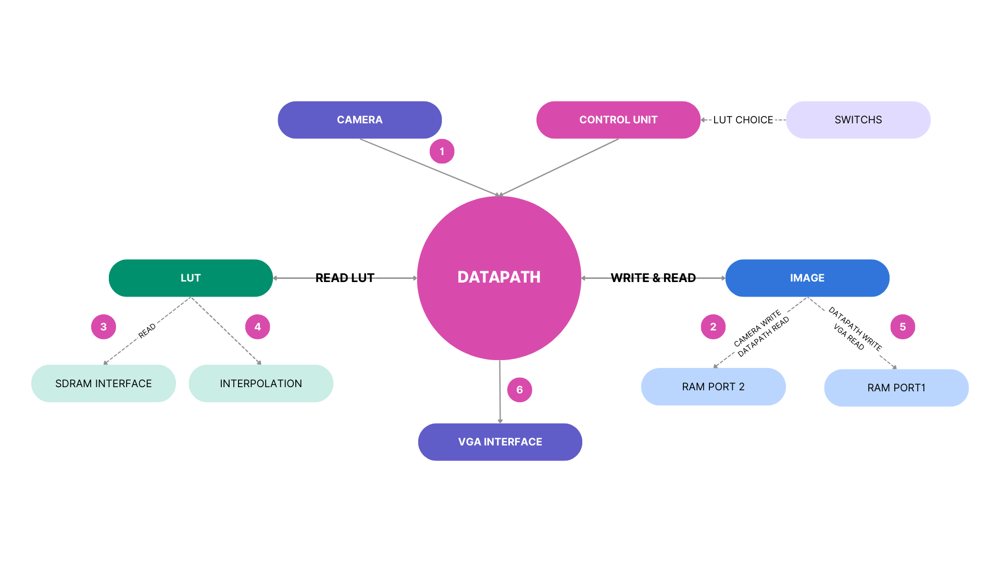

# FPGA_HDR
HDR Imaging on FPGA project for the FPGA lab

The goal of this project is to implement HDR Imaging on FPGA using VHDL. The project was developed on a **Altera DE2-115** board and includes interfaces with a **VGA monitor** and a **TRDB-DC2** camera.

Please check the project's [video demo]().

## User tutorial

The user has several inputs to interact with the circuit:

- KEY(0): *reset* button
- SW(3 downto 0): *LUT choice* switches
- SW(17 downto 12): *exposition time* switches
This report presents our project for the course PHY473R Modal d’Electronique - Circuits logiques programmables (FPGA) at École polytechnique. The goal of our project is to implement High Dynamic Range (HDR) imaging on FPGA. In order to achieve this, we utilized various image processing techniques suitable for FPGA implementation. The project was developed on an Altera DE2-115 board and includes interfaces with a VGA monitor, an LCD, and a TRDB-DC2 camera. The processing algorithms were designed and optimized to perform efficiently on the FPGA hardware.

